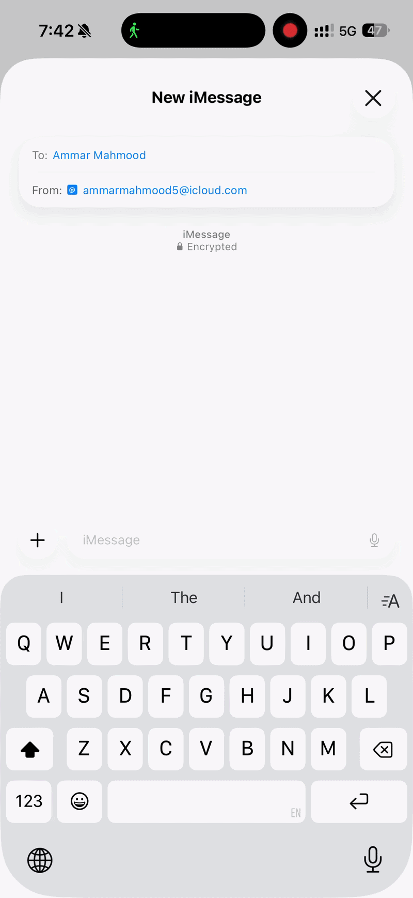

# Tower — Your Morning Copilot

> Text good morning, get a go/no-go flying decision for your home airport with a full pilot briefing.

Tower is an iMessage agent that lives in your texts. It gives pilots — especially student pilots — a daily weather briefing, go/no-go recommendations, METAR/TAF decoding, weather images, quiz mode, and flight hour tracking. No app to open, no UI. Just text.



## Quick Start

### Prerequisites

- **macOS** (required by iMessage SDK)
- **Bun** >= 1.0 (`curl -fsSL https://bun.sh/install | bash`)
- **Full Disk Access** granted to your terminal (System Settings → Privacy & Security → Full Disk Access)
- **AVWX API token** — free at [avwx.rest](https://avwx.rest/auth/register)
- **Azure OpenAI API key** — for explain mode, quiz generation, scenarios

### Setup

```bash
# Clone
git clone https://github.com/ammarjmahmood/tower.git
cd tower

# Install dependencies
bun install

# Configure environment
cp .env.example .env
# Edit .env with your API keys and phone number

# Run
bun run src/index.ts
```

### Environment Variables

```env
AVWX_TOKEN=your_avwx_api_token
AZURE_OPENAI_ENDPOINT=https://your-resource.openai.azure.com
AZURE_OPENAI_API_KEY=your_azure_key
AZURE_OPENAI_DEPLOYMENT=gpt-4o
AZURE_OPENAI_API_VERSION=2024-12-01-preview
MY_PHONE=+1234567890
DEBUG=false
```

Set `MY_PHONE` to your iMessage phone number so Tower only responds to you.

## Commands

### Briefings

| Command | What it does |
|---|---|
| `gm` | Full morning briefing with go/no-go, weather card image |
| `gn` | Tomorrow's outlook with TAF and sunrise |
| `CYTZ` | Decode any airport's current METAR |
| `taf CYTZ` | Forecast breakdown with your minimums flagged |
| `brief CYTZ KBUF` | Multi-airport route weather |
| `radar` | Current radar precipitation image |
| `gfa` | Graphic Area Forecast chart for your region |

### Flying

| Command | What it does |
|---|---|
| `winds CYTZ` | Crosswind component for all runways |
| `flew 1.2 dual` | Log flight time (solo/dual/xc/sim) |
| `hours` | View your flight hour totals |
| `currency` | Check your recency/currency |

### Study

| Command | What it does |
|---|---|
| `quiz` | METAR decode quiz — identify the flight rules |
| `scenario` | AI-generated go/no-go decision scenario |
| `explain` | Re-explain the last weather in student-friendly terms |

### Settings

| Command | What it does |
|---|---|
| `home CYTZ` | Set your home airport |
| `minimums 1000 3` | Set ceiling (ft) / visibility (SM) minimums |
| `wake 0600` | Set morning briefing time |
| `aircraft C172` | Set your aircraft type |
| `priority: task` | Set your daily focus/priority |
| `status` | View all your current settings |

## How It Works

```
You text "gm"
    → Tower fetches METAR, TAF, general weather, sunrise/sunset
    → Runs go/no-go logic against YOUR personal minimums
    → Generates a weather card image
    → Sends it all back as a text message
```

### Go/No-Go Logic

Tower evaluates conditions against your personal minimums:
- **Ceiling** below your minimum → NO GO
- **Visibility** below your minimum → NO GO
- **Crosswind** exceeds your limit → CAUTION/NO GO
- **Flight rules** IFR/LIFR → NO GO (student pilot default)
- **MVFR** → CAUTION

### Weather Card

Every morning briefing includes a generated weather card image showing:
- Flight rules badge (color-coded: green VFR, blue MVFR, red IFR, purple LIFR)
- Wind, visibility, ceiling at a glance
- Temperature, altimeter, sunset
- Crosswind component and TAF trend

## Tech Stack

| Layer | Choice |
|---|---|
| Runtime | Bun |
| Language | TypeScript (strict) |
| iMessage | @photon-ai/imessage-kit |
| AI | Azure OpenAI (GPT-4o) |
| Storage | SQLite via bun:sqlite |
| Image Gen | Satori + resvg-js |
| Weather | AVWX, Open-Meteo, NAV Canada |

## APIs Used

- **[AVWX](https://avwx.rest)** — decoded METARs, TAFs, station info, flight rules
- **[Open-Meteo](https://open-meteo.com)** — general weather (temp, precip, daily forecast)
- **[NAV CANADA](https://plan.navcanada.ca)** — GFA charts, radar composites
- **[Sunrise-Sunset](https://sunrise-sunset.org)** — sunrise, sunset, civil twilight times
- **Azure OpenAI** — METAR explanations, scenario generation, answer evaluation

## Project Structure

```
tower/
├── assets/            — project assets (demo gifs, images)
├── src/
│   ├── index.ts           — entry point, SDK init, message watcher
│   ├── router.ts          — parses messages, routes to command handlers
│   ├── commands/          — one file per command (morning, metar, quiz, etc.)
│   ├── services/          — API wrappers (AVWX, OpenMeteo, Azure OpenAI, etc.)
│   ├── formatters/        — METAR/TAF/crosswind to plain english
│   ├── images/            — Satori weather card template + renderer
│   ├── store/             — SQLite database, preferences, flight log, quiz scores
│   └── utils/             — ICAO validation, time helpers, constants
├── images/                — temp dir for generated/downloaded images
├── .env.example
└── package.json
```

## Testing

```bash
# Run with debug mode to see all messages
DEBUG=true bun run src/index.ts

# Then text your Mac's iMessage from your phone:
# "home CYTZ"     → sets your airport
# "gm"            → full morning briefing
# "CYYZ"          → quick METAR decode
# "quiz"          → test your METAR knowledge
# "help"          → see all commands
```

## Built With

- [Photon iMessage Kit](https://github.com/photon-hq/imessage-kit) — iMessage SDK
- [Azure OpenAI](https://azure.microsoft.com/en-us/products/ai-services/openai-service) — AI features
- [AVWX](https://avwx.rest) — Aviation weather API
- [Satori](https://github.com/vercel/satori) — JSX to SVG
- [@resvg/resvg-js](https://github.com/nicolo-ribaudo/resvg-js) — SVG to PNG

## Running in the Background (LaunchAgent)

To keep Tower running automatically without a terminal window, install it as a macOS LaunchAgent. Tower will start at login and restart if it crashes.

**1. Create the plist file:**

```bash
cat > ~/Library/LaunchAgents/com.tower.imessagebot.plist << 'PLIST'
<?xml version="1.0" encoding="UTF-8"?>
<!DOCTYPE plist PUBLIC "-//Apple//DTD PLIST 1.0//EN" "http://www.apple.com/DTDs/PropertyList-1.0.dtd">
<plist version="1.0">
<dict>
    <key>Label</key>
    <string>com.tower.imessagebot</string>
    <key>ProgramArguments</key>
    <array>
        <string>/Users/YOUR_USERNAME/.bun/bin/bun</string>
        <string>run</string>
        <string>/Users/YOUR_USERNAME/Documents/GitHub/tower/src/index.ts</string>
    </array>
    <key>WorkingDirectory</key>
    <string>/Users/YOUR_USERNAME/Documents/GitHub/tower</string>
    <key>RunAtLoad</key>
    <true/>
    <key>KeepAlive</key>
    <true/>
    <key>StandardOutPath</key>
    <string>/Users/YOUR_USERNAME/Documents/GitHub/tower/tower.log</string>
    <key>StandardErrorPath</key>
    <string>/Users/YOUR_USERNAME/Documents/GitHub/tower/tower.log</string>
    <key>EnvironmentVariables</key>
    <dict>
        <key>HOME</key>
        <string>/Users/YOUR_USERNAME</string>
        <key>PATH</key>
        <string>/usr/local/bin:/usr/bin:/bin:/Users/YOUR_USERNAME/.bun/bin</string>
    </dict>
</dict>
</plist>
PLIST
```

Replace `YOUR_USERNAME` with your macOS username (`whoami` to check).

**2. Load it:**

```bash
launchctl load ~/Library/LaunchAgents/com.tower.imessagebot.plist
```

**3. Check it's running:**

```bash
tail -f ~/Documents/GitHub/tower/tower.log
```

**4. To stop / restart:**

```bash
launchctl unload ~/Library/LaunchAgents/com.tower.imessagebot.plist  # stop
launchctl load   ~/Library/LaunchAgents/com.tower.imessagebot.plist  # start
```

> **Note:** Tower requires the Mac to be on and iMessage to be signed in. It reads iMessage's local SQLite database directly — there is no cloud component.
